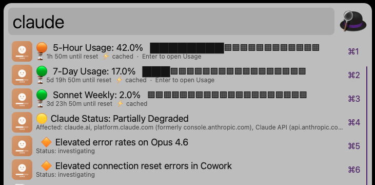
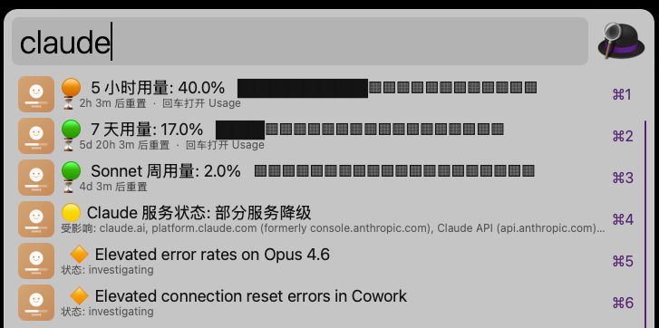

# Claude Usage Monitor - Alfred Workflow

An Alfred workflow to quickly check your Claude (claude.ai) account usage, including 5-hour / 7-day limits, per-model breakdown, and real-time service status.

## Features

- **5-Hour / 7-Day usage** with progress bars and reset timers
- **Per-model breakdown**: Opus, Sonnet, OAuth Apps weekly usage
- **Live service status** from [status.claude.com](https://status.claude.com) with active incident details
- **Multi-auth fallback**: OAuth Token → Keychain → credentials file → Session Key
- **Auto-sync Session Key**: Chrome extension automatically extracts and syncs the `sessionKey` cookie
- **Bilingual UI**: Chinese / English switchable in settings
- **Smart caching**: 60s usage cache, 2min status cache, stale-cache fallback on rate limits

## Demo
English version:



Chinese version:



## Installation

1. Download [`Claude-Usage-Monitor.alfredworkflow`](https://github.com/billyldc/Claude-Usage-Monitor/releases/latest)
2. Double-click to install in Alfred
3. Configure authentication (see below)

## Authentication

The workflow supports multiple auth methods (in priority order):

### 1. OAuth Token (Recommended)

- **Auto-detect**: If you've run `claude auth login` (Claude Code CLI), the token is read from macOS Keychain automatically.
- **Manual**: Paste your OAuth token in the workflow configuration.

### 2. Credentials File

The workflow also reads from `~/.claude/.credentials.json`.

### 3. Session Key (Fallback — via Chrome Extension Auto-Sync)

Session keys from the browser are used as a fallback when OAuth is unavailable. A bundled Chrome extension can **automatically sync** the `sessionKey` cookie to a local file, so you never have to copy-paste it manually.

#### Setup the Chrome Extension

1. Open Chrome → `chrome://extensions` → Enable **Developer Mode** (top-right toggle)
2. Click **Load unpacked** → select the `extension/` folder from this repo
3. Copy the **Extension ID** shown below the extension name
4. Run the install script to register the native messaging host:

```bash
# For Chrome (default):
./install_bridge.sh <extension_id>

# For other browsers:
./install_bridge.sh <extension_id> arc
./install_bridge.sh <extension_id> edge
./install_bridge.sh <extension_id> brave
```

5. Done! The extension will automatically sync your `sessionKey` cookie to `~/.claude-session-key` whenever it changes, and on every browser startup.

> **Manual alternative**: You can still set the session key manually — paste it into the **Session Key** field in the workflow configuration, or save it to `~/.claude-session-key`:
> ```bash
> echo "sk-ant-sid..." > ~/.claude-session-key
> chmod 600 ~/.claude-session-key
> ```

## Usage

Type `claude` in Alfred to see:

| Item | Description |
|------|-------------|
| 5-Hour Usage | Rolling 5-hour utilization with reset timer |
| 7-Day Usage | Weekly utilization with reset timer |
| Model Usage | Opus / Sonnet / OAuth Apps weekly breakdown |
| Service Status | Live status from status.claude.com |

- **Enter** on usage rows → opens [claude.ai/settings/usage](https://claude.ai/settings/usage)
- **Enter** on status row → opens [status.claude.com](https://status.claude.com)
- **Cmd+Enter** on status row → copies raw JSON to clipboard

## Settings

Open the workflow configuration in Alfred to set:

| Setting | Description |
|---------|-------------|
| **Language** | `中文` or `English` |
| **Session Key** | Browser sessionKey cookie (recommended) |
| **OAuth Token** | Manual OAuth token (fallback) |

## Requirements

- macOS
- [Alfred 5](https://www.alfredapp.com/) with Powerpack
- Python 3 (built-in on macOS)

## License

MIT
